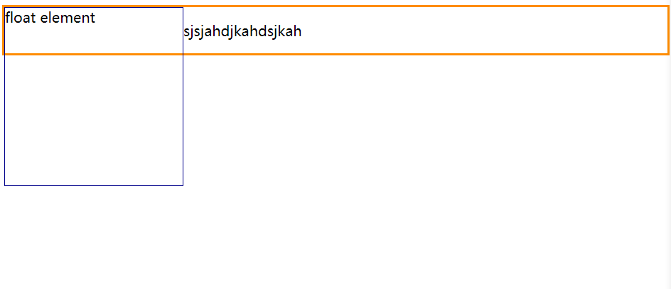
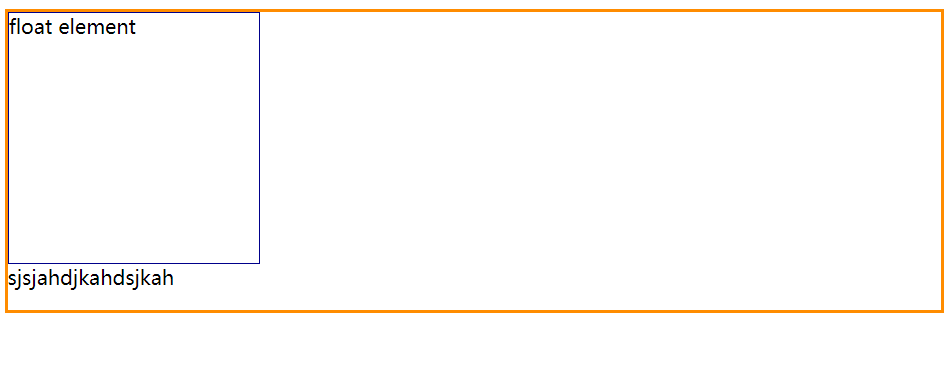
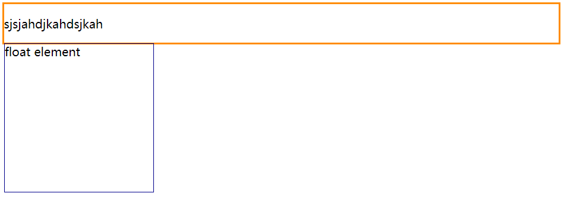
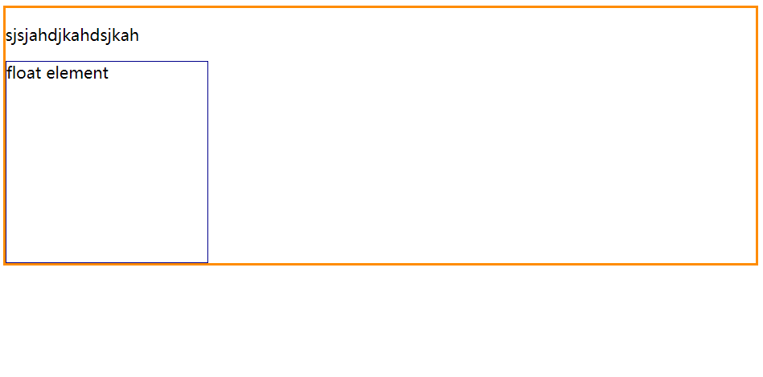
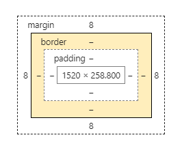

最近在准备前端面试，因此整理了以下前端面试题目，有很多知识点，是从各位大神中的博客中摘取出来的，如果构成侵权，请告知，本文只做分享使用，希望对看到你有所帮助，如有错误或者更好的答案，欢迎交流。持续更新中...如果觉得有用就点个star吧。

### <font color="#09567b">1 SEO优化思路</font>

SEO，全称Search Engine Optimization，即搜索引擎优化，指利用搜索引擎的搜索规则，采取优化策略或程序，提高网站的权重。

+ 页面应该具有合理的title、description、keywords
+ 语义化的HTML代码
+ 重要的HTML代码放在最前面
+ 重要内容不用JS输出，爬虫不执行JS获取内容
+ 少用iframe，爬虫不爬取iframe内容
+ 非装饰性图片必须添加alt
+ 提高网站速度

### <font color="#09567b">2 html语义化</font>

#### <font color="#2ba9e6">2.1 什么是html语义化</font>

简单来说，html的语义化就是使正确的标签做该做的事情，便于开发者阅读和写出更优雅的代码，也能使得爬虫解析变得方便，使网站权重提高。

#### <font color="#2ba9e6">2.2 如何做html的语义化</font>

坚持一个原则：HTML告诉我们一块内容应该是什么，不关心样式，样式是CSS要做的，具体如下：

~~~json
h1~h6：作为标题使用，依据重要性递减
p：段落标记，其中不需要包含换行符
ul ol li ：无序列表
em strong用作强调
q：引用
...
~~~

#### <font color="#2ba9e6">2.3 为什么要进行html语义化</font>

+ 去掉样式，页面结构也很清晰
+ 盲人使用读屏器更好地阅读
+ 搜索引擎更好的理解页面，有利于收录
+ 团队合作也更方便

### 3 BFC详解

>参考https://developer.mozilla.org/zh-CN/docs/Web/Guide/CSS/Block_formatting_context

BFC，全称block formatting context，块级格式化上下文，简单地说，BFC是通过CSS样式定义的独立的一块区域，这个区域的渲染不会影响到其它地方，与外部不相干。

创建的规则：

1. HTML根元素
2. 浮动元素：float为left或right
3. 绝对定位元素(position为absolute或fixed)
4. display为inline-block、table-cell，table-caption，flex，inline-flex，grid，inline-grid
5. overflow不为visible

作用：

1. 包含浮动元素
2. 防止div高度坍缩

### 4 CSS水平居中、垂直居中

#### 4.1 水平居中

+ 块级元素：margin : 0 auto 
+ 行内元素：text-align : center
+ 绝对定位结合transform
+ flex布局结合justify-content:center

#### 4.2 垂直居中

+ 绝对定位结合transform
+ flex布局结合align-items : center
+ line-height : height
+ 父div display:table，子div display : table-cell， vertical-align: middle

### 4.3 水平竖直居中

+ flex布局结合justify-content和align-items
+ 绝对定位结合transform

### 5 清除浮动

结合一个例子讲述为什么需要清除浮动：

~~~html
    <div class="box">
        <div class="float">float element</div>
        <p>sjsjahdjkahdsjkah</p>
    </div>
    
    <style>
        .float {
            float: left;
            width: 200px;
            height: 200px;
            border: 1px darkblue solid;
        }

        .box {
            border: 2px darkorange solid;
        }
    </style>
~~~

运行结果为：



回答一开始的问题：当我们不想让一个元素的旁边出现浮动元素时，需要进行清除浮动。

**方法1**：clear属性

~~~css
        .float {
            float: left;
            width: 200px;
            height: 200px;
            border: 1px darkblue solid;
        }

        .box p {
            /*注意这里：清除左边的浮动*/
            clear: left;
        }

        .box {
            border: 2px darkorange solid;
            /*BFC*/
            overflow: auto;
        }
~~~

将style改成如上，运行结果即变为：



成功。

**方法2**：注意：方法1中，p元素在浮动元素之后，因此我们可以应用上述方法，但如果p元素在浮动元素之前，会变成这样：



此时不论对不对p元素设置clear属性都没什么作用，因为此时p元素旁边并没有浮动元素。

所以此时我认为已经不是一个清除浮动的问题了，我更倾向于认为这是父元素高度坍缩问题，因此将父元素变为BFC即可。

如果非要当作清除浮动问题，只需要在浮动元素下box之中添加一个空元素然后为空元素添加clear:both属性即可。当然也可以使用伪类，为伪类同样添加clear:both属性。

如下：

~~~html
    <style>
        .float {
            float: left;
            width: 200px;
            height: 200px;
            border: 1px darkblue solid;
        }

        .box {
            border: 2px darkorange solid;
        }

        .blank {
            clear: both;
        }
    </style>
    
    <div class="box">
        <p>sjsjahdjkahdsjkah</p>

        <div class="float">float element</div>
        <div class="blank"></div>
    </div>
~~~

运行结果：



或者：

~~~html
    <style>
        .float {
            float: left;
            width: 200px;
            height: 200px;
            border: 1px darkblue solid;
        }

        .box {
            border: 2px darkorange solid;
        }

        .f::after {
            display: block;
            content: "";
            clear: both;
        }
    </style>
    
    <div class="box f">
        <p>sjsjahdjkahdsjkah</p>

        <div class="float">float element</div>
    </div>
~~~

结果和上面一样。

### 6 盒模型

页面渲染时，dom元素所采用的布局模型可使用box-sizing属性进行设置，有如下选择：

+ content-box(W3C标准盒模型)
+ border-box
+ padding-box

上一个图：




### 7 CSS选择器优先级

!important > 行内样式 > #id > .class > tag > * > 继承 > 默认

### 8 展示顺序

层叠等级：

background -> z-index<0 -> block -> float -> inline -> z-index=0/auto -> z-index>0

### 9 rem em px pt

rem：`CSS3`新增的单位，`1rem`等于`html`根元素的字体大小

em：`1em`等于元素的父元素的字体大小

px(像素)：像素与显示设备相关，对于屏幕显示，通常是一个设备像素（点）的显示。对于打印机和高分辨率的屏幕，一个`px`意味着多个设备像素

pt(磅)：`1pt = (1 / 72)in`  `1in`= `96px`，`3pt = 4px`，`25.4mm` =` 96px`

### 10 link vs @import

+ link可以加载css、icon等，但@import只能用于加载css
+ link被解析时即加载CSS，@import所引用的css在页面加载完毕后再被加载
+ @import不能使用js动态引入

### 11 CSS动画

pass

### 12 DOCTYPE

 \<!DOCTYPE>声明位于HTML文档的头部，用于告诉浏览器当前HTML的版本

在 HTML4.01 中`<!doctype>`声明指向一个 DTD，由于 HTML4.01 基于 SGML，所以 DTD 指定了标记规则以保证浏览器正确渲染内容。HTML5 不基于 SGML，所以不用指定 DTD

常见的DOCTYPE:

1. **HTML4.01 strict**：不允许使用表现性、废弃元素（如 font）以及 frameset。声明：`<!DOCTYPE HTML PUBLIC "-//W3C//DTD HTML 4.01//EN" "http://www.w3.org/TR/html4/strict.dtd">`
2. **HTML4.01 Transitional**:允许使用表现性、废弃元素（如 font），不允许使用 frameset。声明：`<!DOCTYPE HTML PUBLIC "-//W3C//DTD HTML 4.01 Transitional//EN" "http://www.w3.org/TR/html4/loose.dtd">`
3. **HTML4.01 Frameset**:允许表现性元素，废气元素以及 frameset。声明：`<!DOCTYPE HTML PUBLIC "-//W3C//DTD HTML 4.01 Frameset//EN" "http://www.w3.org/TR/html4/frameset.dtd">`
4. **XHTML1.0 Strict**:不使用允许表现性、废弃元素以及 frameset。文档必须是结构良好的 XML 文档。声明：`<!DOCTYPE html PUBLIC "-//W3C//DTD XHTML 1.0 Strict//EN" "http://www.w3.org/TR/xhtml1/DTD/xhtml1-strict.dtd">`
5. **XHTML1.0 Transitional**:允许使用表现性、废弃元素，不允许 frameset，文档必须是结构良好的 XMl 文档。声明： `<!DOCTYPE html PUBLIC "-//W3C//DTD XHTML 1.0 Transitional//EN" "http://www.w3.org/TR/xhtml1/DTD/xhtml1-transitional.dtd">`
6. **XHTML 1.0 Frameset**:允许使用表现性、废弃元素以及 frameset，文档必须是结构良好的 XML 文档。声明：`<!DOCTYPE html PUBLIC "-//W3C//DTD XHTML 1.0 Frameset//EN" "http://www.w3.org/TR/xhtml1/DTD/xhtml1-frameset.dtd">`
7. **HTML 5**: `<!doctype html>`

### 13 HTML全局属性

+ accesskey：设置快捷键
+ class
+ contenteditable：指定元素内容是否可编辑
+ contextmenu：自定义鼠标右键弹出菜单的内容
+ data-*：为元素增加自定义属性
+ dir：设置元素文本方向
+ draggable：设置元素拖放类型
+ hidden：表示一个元素是否显示
+ id
+ lang：语言
+ spellcheck
+ style
+ title
+ tabindex

### 14 如何显示\<div>\</div>这个字符

&ltdiv&gt&lt/div&gt

### 15 placehoder属性

placeholder 属性提供可描述输入字段预期值的提示信息（hint）

### 16 CSS伪类 vs 伪元素

伪元素：::after ::before ::first-letter ::first-line

伪类: 

+ :active
+ :focus
+ :hover
+ :link
+ :visited
+ :first-child
+ :lang

> 针对作用选择器的效果，伪类需要添加类来达到效果，而伪元素需要增加元素tag，所以一个叫伪类，另外一个叫伪元素。

### 17 CSS属性继承

display属性不继承，visibility属性继承

### 18 块级元素 行内元素

块级元素：block element，每个块级元素默认占一行高度，一行内添加一个块级元素后无法添加其他元素(float浮动后除外)。块级元素一般作为容器出现，用来组织结构。

行内元素：inline element，行内元素一般是基于语义级的基本元素，只能容纳文本或其它内联元素。

常见块级元素：

+ address
+ blockquote
+ center
+ dir
+ div
+ dl
+ fieldset
+ form
+ h1
+ h2
+ h3
+ h4
+ h5
+ h6
+ hr
+ menu
+ noscript
+ ol
+ p
+ pre
+ table
+ ul

常见行内元素：

+ a
+ abbr
+ b
+ big
+ br
+ cite
+ code
+ em
+ font
+ i
+ img
+ input
+ kbd
+ label
+ q
+ s
+ samp
+ select
+ small
+ span
+ strike
+ strong
+ sub
+ sup
+ textarea
+ tt
+ u

### 19 line-height:2 VS line-height:200%

line-height为2时，子元素继承父元素line-height属性，会根据子元素的字体大小动态计算出行高。而line-height为200%时，父元素的行高为200%时，会根据父元素的字体大小先计算出行高值然后再让子元素继承。

### 20 JS 基本数据类型

六种基本数据类型：boolean string number undefined null Symbol(ES6)

~~~js
var a = 1, b = "s", c, d = true, e = null, f = Symbol()

console.log(typeof (a), typeof (b), typeof (c), typeof (d), typeof (e), typeof (f))// number string undefined boolean object symbol
~~~

### 21 JS 原型链

>继承是OO语言中的一个最为人津津乐道的概念.许多OO语言都支持两种继承方式: **接口继承** 和 **实现继承** .接口继承只继承方法签名,而实现继承则继承实际的方法.由于js中方法没有签名,在ECMAScript中无法实现接口继承.ECMAScript只支持实现继承,而且其 `实现继承` 主要是依靠原型链来实现的.
>
>by JavaScript高级程序设计

**构造函数、实例对象和原型之间的关系：**每个构造函数有一个原型对象(constructor.prototype)，原型对象包含一个指向构造函数的指针，实例都包含一个指向原型对象的内部指针(instance.\_\_proto__)。

>如果试图引用对象(实例instance)的某个属性,会首先在对象内部寻找该属性,直至找不到,然后才在该对象的原型(instance.prototype)里去找这个属性.

~~~js
        function Father() {
            this.name = "baba"
        }

        Father.prototype.getFatherName = function () {
            return this.name
        }

        function Son() {
            this.sonName = "son"
        }

        // 继承
        Son.prototype = new Father()
        Son.prototype.getSonName = function () {
            return this.name
        }
        var son = new Son()

        console.log(son.getFatherName()) // baba
~~~

在这个例子中，我们将子类Son的原型对象初始化为Father，此时调用son.getFatherName()方法就会首先在son内部寻找，发现找不到，于是去son.\__proto__即Son.prototype中去找，Son.prototype是指Father实例，寻找不到，又到了Father实例的原型中去寻找，就找到了

这种搜索的轨迹,形似一条长链, 又因prototype在这个游戏规则中充当链接的作用,于是我们把这种实例与原型的链条称作 **原型链** 。

使用 **instanceof** 操作符, 只要用这个操作符来测试实例(instance)与原型链中出现过的构造函数,结果就会返回true. 以下几行代码就说明了这点.

~~~js
alert(instance instanceof Object);//true
alert(instance instanceof Father);//true
alert(instance instanceof Son);//true
~~~

son -> Son.prototype(father) -> Father.prototype -> Object.prototype

使用 **isPrototypeOf()** 方法, 同样只要是原型链中出现过的原型,isPrototypeOf() 方法就会返回true, 如下所示。

~~~js
alert(Object.prototype.isPrototypeOf(instance));//true
alert(Father.prototype.isPrototypeOf(instance));//true
alert(Son.prototype.isPrototypeOf(instance));//true
~~~

用图像进一步说明。来源于https://github.com/mqyqingfeng/blog/issues/2


这条蓝色的线就是原型链。

### 22 闭包

闭包是JavaScript中十分重要也很难理解的概念。

变量作用域分为 全局作用域 函数作用域 块级作用域 词法作用域及动态作用域

在JavaScript中，函数内部可以直接读取全局作用域的变量。

~~~js
var n = 999;
function f() {
   console.log(n)
}
f() // 999
~~~

函数外部无法读取函数内部的局部变量，因为是局部变量处于函数作用域。

~~~js
function f1(){
　　var n=999;
}

console.log(n); // error
~~~

但由于种种原因，我们想要读取函数内部的变量，因此便引出了闭包。可以首先建立一个概念，闭包就是在函数中定义子函数，在子函数中获取函数的内部变量并返回，如下。

~~~js
        function f2() {
            var n = 999
            function f3() {
                console.log(n)
            }
            return f3
        }

        f2()()//999
~~~

f3函数便是一个闭包。阮一峰定义闭包为“能够读取其他函数内部变量的函数”，闭包就是将函数内部和函数外部链接的一座桥梁。

> 1）由于闭包会使得函数中的变量都被保存在内存中，内存消耗很大，所以不能滥用闭包，否则会造成网页的性能问题，在IE中可能导致内存泄露。解决方法是，在退出函数之前，将不使用的局部变量全部删除。
>
> 2）闭包会在父函数外部，改变父函数内部变量的值。所以，如果你把父函数当作对象（object）使用，把闭包当作它的公用方法（Public Method），把内部变量当作它的私有属性（private value），这时一定要小心，不要随便改变父函数内部变量的值。

### 23 CORS

CORS用于解决ajax跨域问题，全称跨域资源共享。

首先，何为跨域？协议不同，域名不同，端口不同都会导致跨域。

解决方法主要有jsonp和CORS。

其中jsonp只能适用于get请求，且需要有后台支持，后台主要负责数据的封装，利用了script src不受跨域问题的干扰的特点衍生而出，前台负责数据的处理。而CORS适用于所有请求，对于开发者来说，CORS通信与同源的AJAX通信没有差别，代码完全一样，实现CORS通信的关键是服务器，只要服务器实现了CORS接口，就可以实现跨源通信。

浏览器将CORS请求分为两类：简单请求和非简单请求。

简单请求：

~~~json
（1) 请求方法是以下三种方法之一：

HEAD
GET
POST
（2）HTTP的头信息不超出以下几种字段：

Accept
Accept-Language
Content-Language
Last-Event-ID
Content-Type：只限于三个值application/x-www-form-urlencoded、multipart/form-data、text/plain
~~~

对于简单请求，浏览器发出跨域请求之后，会在头信息之中增加一个Origin字段(这是浏览器自动进行的)，`Origin`字段用来说明，本次请求来自哪个源（协议 + 域名 + 端口），然后服务器会根据这个值，按自己的配置决定是否同意请求。如果`Origin`指定的域名在许可范围内，服务器返回的响应，会多出几个头信息字段。

~~~json
Access-Control-Allow-Origin: http://api.bob.com
Access-Control-Allow-Credentials: true
Access-Control-Expose-Headers: FooBar
Content-Type: text/html; charset=utf-8
~~~

**（1）Access-Control-Allow-Origin**

该字段是必须的。它的值要么是请求时`Origin`字段的值，要么是一个`*`，表示接受任意域名的请求。

**（2）Access-Control-Allow-Credentials**

该字段可选。它的值是一个布尔值，表示是否允许发送Cookie。默认情况下，Cookie不包括在CORS请求之中。设为`true`，即表示服务器明确许可，Cookie可以包含在请求中，一起发给服务器。这个值也只能设为`true`，如果服务器不要浏览器发送Cookie，删除该字段即可。

**（3）Access-Control-Expose-Headers**

该字段可选。CORS请求时，`XMLHttpRequest`对象的`getResponseHeader()`方法只能拿到6个基本字段：`Cache-Control`、`Content-Language`、`Content-Type`、`Expires`、`Last-Modified`、`Pragma`。如果想拿到其他字段，就必须在`Access-Control-Expose-Headers`里面指定。上面的例子指定，`getResponseHeader('FooBar')`可以返回`FooBar`字段的值。

所以对于简单请求，我们的思路就很明确了，如果项目有后台，就让后台指定Access-Control-Allow-Origin为*就行了。

对于复杂请求，比如请求方法是`PUT`或`DELETE`，或者`Content-Type`字段的类型是`application/json`。会在正式通信之前，增加一次HTTP查询请求，称为"预检"请求（preflight）。浏览器先询问服务器，当前网页所在的域名是否在服务器的许可名单之中，以及可以使用哪些HTTP动词和头信息字段。只有得到肯定答复，浏览器才会发出正式的`XMLHttpRequest`请求，否则就报错。如：

~~~js
var url = 'http://api.alice.com/cors';
var xhr = new XMLHttpRequest();
xhr.open('PUT', url, true);
xhr.setRequestHeader('X-Custom-Header', 'value');
xhr.send();
~~~

上面代码中，HTTP请求的方法是`PUT`，并且发送一个自定义头信息`X-Custom-Header`。

浏览器发现，这是一个非简单请求，就自动发出一个"预检"请求，要求服务器确认可以这样请求。下面是这个"预检"请求的HTTP头信息。

~~~js
OPTIONS /cors HTTP/1.1
Origin: http://api.bob.com
Access-Control-Request-Method: PUT
Access-Control-Request-Headers: X-Custom-Header
Host: api.alice.com
Accept-Language: en-US
Connection: keep-alive
User-Agent: Mozilla/5.0...
~~~

除了`Origin`字段，"预检"请求的头信息包括两个特殊字段。

**（1）Access-Control-Request-Method**

该字段是必须的，用来列出浏览器的CORS请求会用到哪些HTTP方法，上例是`PUT`。

**（2）Access-Control-Request-Headers**

该字段是一个逗号分隔的字符串，指定浏览器CORS请求会额外发送的头信息字段，上例是`X-Custom-Header`。

服务器收到"预检"请求以后，检查了`Origin`、`Access-Control-Request-Method`和`Access-Control-Request-Headers`字段以后，确认允许跨源请求，就可以做出回应。

~~~json
HTTP/1.1 200 OK
Date: Mon, 01 Dec 2008 01:15:39 GMT
Server: Apache/2.0.61 (Unix)
Access-Control-Allow-Origin: http://api.bob.com
Access-Control-Allow-Methods: GET, POST, PUT
Access-Control-Allow-Headers: X-Custom-Header
Content-Type: text/html; charset=utf-8
Content-Encoding: gzip
Content-Length: 0
Keep-Alive: timeout=2, max=100
Connection: Keep-Alive
Content-Type: text/plain
~~~

**（1）Access-Control-Allow-Methods**

该字段必需，它的值是逗号分隔的一个字符串，表明服务器支持的所有跨域请求的方法。注意，返回的是所有支持的方法，而不单是浏览器请求的那个方法。这是为了避免多次"预检"请求。

**（2）Access-Control-Allow-Headers**

如果浏览器请求包括`Access-Control-Request-Headers`字段，则`Access-Control-Allow-Headers`字段是必需的。它也是一个逗号分隔的字符串，表明服务器支持的所有头信息字段，不限于浏览器在"预检"中请求的字段。

**（3）Access-Control-Allow-Credentials**

该字段与简单请求时的含义相同。

**（4）Access-Control-Max-Age**

该字段可选，用来指定本次预检请求的有效期，单位为秒。上面结果中，有效期是20天（1728000秒），即允许缓存该条回应1728000秒（即20天），在此期间，不用发出另一条预检请求。

如在SpringBoot中配置CORS。

~~~java
@Configuration
public class CORSConfig implements WebMvcConfigurer {

    @Override
    public void addCorsMappings(CorsRegistry corsRegistry) {
        corsRegistry.addMapping("/**")
                .allowedOrigins(ALL)
                .allowedMethods(ALL)
                .allowedHeaders(ALL)
                .allowCredentials(true);
    }

}
~~~

以上结合阮一峰老师文章[跨域资源共享CORS详解](http://www.ruanyifeng.com/blog/2016/04/cors.html)写成。

### 24 HTTP状态码

+ 1xx：信息状态码
  + 100 continue 客户端应当继续发送请求，该响应用于通知客户端请求已被服务器接收，且仍未被拒绝，客户端应当继续发送请求的剩余部分，或者如果请求已经完成，忽略这个响应。
  + 101 指服务器将按照其上的头信息变为一个不同的协议
+ 2xx：成功状态码
  + 200 OK 请求成功
  + 201 Created
  + 202 Accepted 告诉客户端请求正在被执行，但还没有处理完
  + 203 Non-Authoritative Information
  + 204 No Content
  + 205 Reset Content
  + 206 Partial Content
+ 3xx：重定向
  + 300 多选择
  + 301 永久重定向
  + 302 临时重定向
  + 303 参见其他信息
  + 304 修正
  + 305 使用代理
  + 307 临时重定向，和302类似
+ 4xx：客户端错误
  + 400 错误的请求
  + 401 未授权
  + 403 禁止
  + 404 未找到
  + 405 方法不允许
  + 406 无法访问
  + ...
+ 5xx：服务端错误
  + 500 Internal Server Error
  + 501 未实现
  + 502 错误的网关
  + 503 服务无法获得
  + 504 网关超时
  + 505 不支持的HTTP版本

### 25 函数防抖 函数节流

用于在时间轴上控制函数的执行次数。

函数防抖：指在事件被触发n秒后再执行回调，如果在这n秒内又被触发，则重新计时。

> 理解：如果有人进电梯（触发事件），那电梯将在10秒钟后出发（执行事件监听器），这时如果又有人进电梯了（在10秒内再次触发该事件），我们又得等10秒再出发（重新计时）。

~~~js
function debounce(fn) {
    let timeout = null;
    return function () {
        // 重新计时
        clearTimeout(timeout);
        // 0.5秒
        timeout = setTimeout(() => {
            console.log(arguments)
            fn.apply(this, arguments)
        }, 300)
    };
}
function sayhi() {
    console.log("防抖")
    this.style.color = "red"
}
var inp = document.getElementById("inp");
inp.addEventListener('input', debounce(sayhi))
~~~

这里面需要注意的是apply函数的第一个参数，不能直接写fn()，因为这里需要改变this的指向，我们给input输入框绑定了debounce事件之后，this应该指向input。

函数节流：指在一段时间只能触发一次事件的回调函数

> 理解：可用于高频事件，使得n秒内仅执行一次，稀释函数的执行频率

~~~js
function throttle(fn) {
    // 是否可以运行
    let canRun = true;
    return function () {
        if (!canRun) return;
        canRun = false;
        setTimeout(() => {
            fn.apply(this, arguments);
            // 最后在setTimeout执行完毕后再把标记设置为true(关键)表示可以执行下一次循环了。当定时器没有执行的时候标记永远是false，在开头被return掉
            canRun = true;
        }, 500)
    }
}
function sayhi(e) {
    console.log(e.target.innerWidth)
}
// 添加resize事件
window.addEventListener('resize', throttle(sayhi));
~~~

参考：

https://github.com/Advanced-Frontend/Daily-Interview-Question/issues/5

### 26 数组常用方法

forEach(遍历)

~~~js
var arr = [1, 2, 3, 4, 5]
arr.forEach((item, index, arr) => {
    console.log(index + "----" + item)//1---1 2---2 ...
})
~~~

map(遍历返回新数组)

~~~js
var arr = [1, 2, 3, 4, 5]
var s = arr.map((item, index) => {
    return index * index
})
console.log(s) // [1,4,9,16,25]
~~~

reduce(累加)

~~~~js
var arr = [1, 2, 3, 4, 5]
var ss = arr.reduce(function (res, curr) {
    // res为累加的值，curr为现在的值
    return res + curr
}, 0)

console.log(ss) // 15
~~~~

filter(过滤返回判断为true的)

~~~js
var arr = [1, 2, 3, 4, 5]
var sss = arr.filter((item, index) => {
    if (item > 1) {
        return true;
    }
})
console.log(sss)// [2,3,4,5]
~~~

some(判断数组中有无满足callback的)

~~~js
var arr = [1, 2, 3, 4, 5]
console.log(arr.some((item, index) => {
    return item > 3
}))// true
~~~

every(判断数组是否都满足callback)

~~~json
var arr = [1, 2, 3, 4, 5]
console.log(arr.every((item, index) => {
    return item > 3
}))// false
~~~

splice：增加，删除，更新都可以，两个参数就是删除，三个就是更新或者添加

pop：出栈

push：压栈

unshift：进队列

shift：出队列

concat：合并

sort：排序

slice：选取数组的一部分

### 27 排序方法

sort

~~~js
var arr = [2, 5, 7, 5, 6, 2, 1, 0]
arr.sort((a, b) => {
    return a - b
})
console.log(arr)// [0, 1, 2, 2, 5, 5, 6, 7]
~~~

若要从小到大排序：

- 若 a 小于 b，在排序后的数组中 a 应该出现在 b 之前，则返回一个小于 0 的值。
- 若 a 等于 b，则返回 0。
- 若 a 大于 b，则返回一个大于 0 的值

### 28 深拷贝 浅拷贝

在介绍深拷贝和浅拷贝之前，需要明确，基本类型的比较是值的比较，只要它们的值相等就认为他们相等，引用类型的比较是引用的比较(相当于指针的比较)。

~~~js
var a = 1;
var b = 1;
console.log(a === b);//true
~~~

~~~js
var a = [1,2,3];
var b = [1,2,3];
console.log(a === b); // false
~~~

在我们进行赋值操作的时候，基本数据类型的赋值（=）是在内存中新开辟一段栈内存，然后再把再将值赋值到新的栈中。但是引用类型的赋值是传址。只是改变指针的指向，例如，也就是说引用类型的赋值是对象保存在栈中的地址的赋值，这样的话两个变量就指向同一个对象，因此两者之间操作互相有影响。

浅拷贝就是对基本类型数据进行拷贝，但对引用类型只相当于赋值。

~~~js
    var obj1 = {
        'name' : 'zhangsan',
        'age' :  '18',
        'language' : [1,[2,3],[4,5]],
    };

    var obj2 = obj1;


    var obj3 = shallowCopy(obj1);
    function shallowCopy(src) {
        var dst = {};
        for (var prop in src) {
            if (src.hasOwnProperty(prop)) {
                dst[prop] = src[prop];
            }
        }
        return dst;
    }

    obj2.name = "lisi";
    obj3.age = "20";

    obj2.language[1] = ["二","三"];
    obj3.language[2] = ["四","五"];

    console.log(obj1);  
    //obj1 = {
    //    'name' : 'lisi',
    //    'age' :  '18',
    //    'language' : [1,["二","三"],["四","五"]],
    //};

    console.log(obj2);
    //obj2 = {
    //    'name' : 'lisi',
    //    'age' :  '18',
    //    'language' : [1,["二","三"],["四","五"]],
    //};

    console.log(obj3);
    //obj3 = {
    //    'name' : 'zhangsan',
    //    'age' :  '20',
    //    'language' : [1,["二","三"],["四","五"]],
    //};
~~~

先定义个一个原始的对象 `obj1`，然后使用赋值得到第二个对象 `obj2`，然后通过浅拷贝，将 `obj1` 里面的属性都赋值到 `obj3` 中。也就是说：

- `obj1`：原始数据
- `obj2`：赋值操作得到
- `obj3`：浅拷贝得到

深拷贝是对基本类型和引用类型的全拷贝。主要方法有json.parse和json.stringfy对象(无法应用于有function的)、for...in。

**递归：**

~~~js
    var obj1 = {
        'name': 'zhangsan',
        'age': '18',
        'language': [1, [2, 3], [4, 5]],
    };

    function deepCopy(initalObj, finalObj) {
        var obj = finalObj || {};
        for (var i in initalObj) {
            var prop = initalObj[i];
            if (prop === obj) {
                continue;
            }
            if (typeof prop === 'object') {
                obj[i] = (prop.constructor === Array) ? [] : {};
                arguments.callee(prop, obj[i]);
            } else {
                obj[i] = prop;
            }
        }
        return obj;
    }
    var target = {};
    deepCopy(obj1, target)
    console.log(target)
~~~

**JSON.parse**：

~~~js
console.log(JSON.parse(JSON.stringify(obj1)))
~~~

但是这种方法也有不少坏处，譬如它会抛弃对象的constructor。也就是深拷贝之后，不管这个对象原来的构造函数是什么，在深拷贝之后都会变成Object。

这种方法能正确处理的对象只有 Number, String, Boolean, Array, 扁平对象，即那些能够被 json 直接表示的数据结构。RegExp、function、symbol对象是无法通过这种方式深拷贝。

**Object.create()**：

直接使用var newObj = Object.create(oldObj)，可以达到深拷贝的效果。

~~~js
 function deepClone(initalObj, finalObj) {
     var obj = finalObj || {};
     for (var i in initalObj) {
         var prop = initalObj[i];        
         if (prop === obj) {
             continue;
         }
         if (typeof prop === 'object') {
             if (prop.constructor === Array) {
                 obj[i] = []
                 arguments.callee(prop, obj[i]);
             } else
                 obj[i] = Object.create(prop);
         } else {
             obj[i] = prop;
         }
     }
     return obj;
 }
~~~

|        | 和原数据是否指向同一对象 | 第一层数据为基本数据类型     | 原数据中包含子对象           |
| ------ | ------------------------ | ---------------------------- | ---------------------------- |
| 赋值   | 是                       | 改变会使原数据一同改变       | 改变会使原数据一同改变       |
| 浅拷贝 | 否                       | 改变**不**会使原数据一同改变 | 改变会使原数据一同改变       |
| 深拷贝 | 否                       | 改变**不**会使原数据一同改变 | 改变**不**会使原数据一同改变 |

### 29 this apply call bind

#### this指向问题

this的指向始终遵循：**this永远指向最后调用它所在函数的那个对象**。

~~~js
        var str = "window"
        function a() {
            var str = "a"
            return this.str
        }
        console.log(a()) // window
~~~

由于调用a函数的是window，相当于window.a()，所以this指向window，所以返回"window"。

~~~js
        var str = "window"
        var a = {
            str: "a",
            fn: function () {
                console.log(this.str);
            }
        }
        a.fn()// a
~~~

调用fn函数的是a对象，this指向a，所以为"a"

#### 改变this指向

使用下面这个例子进行下面的实验：

~~~js
        var str = "window"
        var a = {
            str: "a",
            fn: function () {
                console.log(this.str);
            },
            fn2: function () {
                var s = function () {
                    this.fn()
                }
                setTimeout(s, 1000)
            }
        }
        a.fn2()
~~~

这个例子中**匿名函数的 this 永远指向 window**，因此会报无fn函数。

+ 使用箭头函数

  > 箭头函数中没有 this 绑定，必须通过查找作用域链来决定其值，如果箭头函数被非箭头函数包含，则 this 绑定的是最近一层非箭头函数的 this，否则，this 为 undefined

  ~~~js
          var str = "window"
          var a = {
              str: "a",
              fn: function () {
                  console.log(this.str);
              },
              fn2: function () {
                  var s = () => {
                      this.fn()
                  }
                  setTimeout(s, 1000)
              }
          }
          a.fn2()
  ~~~

+ _this = this

  ~~~js
          var str = "window"
          var a = {
              str: "a",
              fn: function () {
                  console.log(this.str);
              },
              fn2: function () {
                  var _this = this
                  var s = function () {
                      _this.fn()
                  }
                  setTimeout(s, 1000)
              }
          }
          a.fn2()
  ~~~

+ apply call bind

  ~~~js
          var str = "window"
          var a = {
              str: "a",
              fn: function () {
                  console.log(this.str);
              },
              fn2: function () {
                  var _this = this
                  var s = function () {
                      this.fn()
                  }
                  setTimeout(s.apply(a), 1000)
                  setTimeout(s.call(a), 1000)
                  setTimeout(s.bind(a)(), 1000)
              }
          }
          a.fn2()
  ~~~

  + 区别和联系
    + apply 、 call 、bind 三者都是用来改变函数的this对象的指向的；
    + apply 、 call 、bind 三者第一个参数都**是this要指向的对象**，也就是想指定的上下文；
    + apply 、 call 、bind 三者都可以利用后续参数传参；
    + bind 是返回对应函数，便于稍后调用；apply 、call 则是立即调用 。

### 30 作用域

JavaScript中作用于主要有：全局作用域 | 函数作用域 | 块级作用域 

#### 全局作用域

全局变量存在于整个程序运行期间，可以被程序内任何函数或者方法访问。

**显式声明：**

~~~js
var testValue = 123;

var testFunc = function () { console.log('just test') };

/**---------全局变量会挂载到 window 对象上------------**/

console.log(window.testFunc)		// ƒ () { console.log('just test') }

console.log(window.testValue)		// 123
~~~

**隐式声明：**

~~~js
    function foo(value) {
      result = value + 1;	 // 没有用 var 修饰
      return result;
    };
    foo(123);				// 124
    console.log(window.result);			// 124 <=  挂在了 window全局对象上 
~~~

#### 函数作用域

在函数内部声明的变量仅存在于函数生命周期之中。要想获得函数内部声明的变量，可以通过闭包和return函数。

~~~js
function bar() {
  var value = 'inner';
}

console.log(value);		// 报错：ReferenceError: value is not defined

~~~

#### 块级作用域

Es6新增，类似于Java。在Es5中：

~~~js
for(var i = 0; i < 5; i++) {
  // ...
}

console.log(i)				// 5
~~~

如上代码，for循环之后，var变量依然存在，并没有产生像函数作用域一样的封闭效果。

块级作用域使用let声明。

~~~js
for(let i = 0; i < 5; i++) {
  // ...
}

console.log(i)				// 报错：ReferenceError: i is not defined
~~~

同样能形成块级作用域的还有 `const` 关键字：

~~~js
if (true) {
  const a = 'inner';
}

console.log(a);				// 报错：ReferenceError: a is not defined
~~~

### 31 ECMAScript vs JavaScript

ECMAScript定义规范，JavaScript实现规范。

### 32 callee vs caller

callee是arguments对象的一个属性、用来指向当前执行的函数。

~~~js
function fun() {
    console.log(arguments.callee);
}
fun(); // fun函数
~~~

callee还可以用来递归调用匿名函数

~~~js
(function(){
    alert(1);
    arguments.callee();
})();
~~~

~~~js
function fun1(){
	console.log(arguments.callee.caller); // 
}
function fun2(){
    fun1();
}
fun1();// null
fun2();// fun2
~~~

caller是function对象的一个属性，用于返回一个function引用、它返回调用它的function对象、若直接在全局环境下调用fun1 则返回null、在fun2里调用之后返回fun2、

### 33 new过程

~~~js
// 构造函数:
function myFunction(arg1, arg2) {
    this.firstName = arg1;
    this.lastName  = arg2;
}

// This    creates a new object
var a = new myFunction("Li","Cherry");
a.lastName;                             // 返回 "Cherry"
~~~

new的过程如下：

~~~js
var a = new myFunction("Li","Cherry");

new myFunction{
    var obj = {};
    obj.__proto__ = myFunction.prototype;
    var result = myFunction.call(obj,"Li","Cherry");
    return typeof result === 'obj'? result : obj;
}
~~~

1. 创建一个空对象 obj;
2. 将新创建的空对象的隐式原型指向其构造函数的显示原型。
3. 使用 call 改变 this 的指向
4. 如果无返回值或者返回一个非对象值，则将 obj 返回作为新对象；如果返回值是一个新对象的话那么直接直接返回该对象。

### 34 TCP 三次握手

- 第一次握手(SYN=1, seq=x):

  客户端发送一个 TCP 的 SYN 标志位置1的包，指明客户端打算连接的服务器的端口，以及初始序号 X,保存在包头的序列号(Sequence Number)字段里。

  发送完毕后，客户端进入 `SYN_SEND` 状态。

- 第二次握手(SYN=1, ACK=1, seq=y, ACKnum=x+1):

  服务器发回确认包(ACK)应答。即 SYN 标志位和 ACK 标志位均为1。服务器端选择自己 ISN 序列号，放到 Seq 域里，同时将确认序号(Acknowledgement Number)设置为客户的 ISN 加1，即X+1。 发送完毕后，服务器端进入 `SYN_RCVD` 状态。

- 第三次握手(ACK=1，ACKnum=y+1)

  客户端再次发送确认包(ACK)，SYN 标志位为0，ACK 标志位为1，并且把服务器发来 ACK 的序号字段+1，放在确定字段中发送给对方，并且在数据段放写ISN的+1

  发送完毕后，客户端进入 `ESTABLISHED` 状态，当服务器端接收到这个包时，也进入 `ESTABLISHED` 状态，TCP 握手结束。

### 35 继承
https://juejin.im/post/5bcb2e295188255c55472db0
八种继承方法。
1. 原型链继承，将子类的原型赋值为父类。
   ~~~js
    function SuperType() {
        this.property = true;
    }

    SuperType.prototype.getSuperValue = function() {
        return this.property;
    }

    function SubType() {
        this.subproperty = false;
    }

    // 这里是关键，创建SuperType的实例，并将该实例赋值给SubType.prototype
    SubType.prototype = new SuperType(); 

    SubType.prototype.getSubValue = function() {
        return this.subproperty;
    }

    var instance = new SubType();
    console.log(instance.getSuperValue()); // true
    ~~~

    原型链方案存在的缺点：多个实例对引用类型的操作会被篡改。

    ~~~js
    function SuperType(){
        this.colors = ["red", "blue", "green"];
    }
    function SubType(){}

    SubType.prototype = new SuperType();

    var instance1 = new SubType();
    instance1.colors.push("black");
    alert(instance1.colors); //"red,blue,green,black"

    var instance2 = new SubType(); 
    alert(instance2.colors); //"red,blue,green,black"
    ~~~
2. 借用父类的构造函数继承
   ~~~js
    function  SuperType(){
        this.color=["red","green","blue"];
    }
    function  SubType(){
        //继承自SuperType
        SuperType.call(this);
    }
    var instance1 = new SubType();
    instance1.color.push("black");
    alert(instance1.color);//"red,green,blue,black"

    var instance2 = new SubType();
    alert(instance2.color);//"red,green,blue"
   ~~~
   核心代码是SuperType.call(this)，创建子类实例时调用SuperType构造函数，于是SubType的每个实例都会将SuperType中的属性复制一份。
   缺点：
      + 只能继承父类的实例属性和方法，不能继承原型属性/方法
      + 无法实现复用，每个子类都有父类实例函数的副本，影响性能
3. 组合继承
   组合上述两种方法就是组合继承。用原型链实现对原型属性和方法的继承，用借用构造函数技术来实现实例属性的继承。
    ~~~js
    function SuperType(name){
    this.name = name;
    this.colors = ["red", "blue", "green"];
    }
    SuperType.prototype.sayName = function(){
    alert(this.name);
    };

    function SubType(name, age){
    // 继承属性
    // 第二次调用SuperType()
    SuperType.call(this, name);
    this.age = age;
    }

    // 继承方法
    // 构建原型链
    // 第一次调用SuperType()
    SubType.prototype = new SuperType(); 
    // 重写SubType.prototype的constructor属性，指向自己的构造函数SubType
    SubType.prototype.constructor = SubType; 
    SubType.prototype.sayAge = function(){
        alert(this.age);
    };

    var instance1 = new SubType("Nicholas", 29);
    instance1.colors.push("black");
    alert(instance1.colors); //"red,blue,green,black"
    instance1.sayName(); //"Nicholas";
    instance1.sayAge(); //29

    var instance2 = new SubType("Greg", 27);
    alert(instance2.colors); //"red,blue,green"
    instance2.sayName(); //"Greg";
    instance2.sayAge(); //27
    ~~~
    组合继承方式通过原型继承的方式继承方法，通过构造器继承的方式继承实例的属性和方法。其缺点在于不能通过原型继承的方式继承原型的属性，否则会存在多个实例对引用类型的操作会被篡改的问题。在使用子类创建实例对象时，其原型中会存在两份相同的属性/方法。

### 36 Promise

https://www.cnblogs.com/lvdabao/p/es6-promise-1.html
异步

### 37 Object.create()

用于初始化一个新对象
https://juejin.im/post/5acd8ced6fb9a028d444ee4e
使用create创建的对象，没有任何属性，显示No properties，我们可以把它当作一个非常纯净的map来使用，我们可以自己定义hasOwnProperty、toString方法，不管是有意还是不小心，我们完全不必担心会将原型链上的同名方法覆盖掉。
~~~js
//Demo1:
var a= {...省略很多属性和方法...};
//如果想要检查a是否存在一个名为toString的属性，你必须像下面这样进行检查：
if(Object.prototype.hasOwnProperty.call(a,'toString')){
    ...
}
//为什么不能直接用a.hasOwnProperty('toString')?因为你可能给a添加了一个自定义的hasOwnProperty
//你无法使用下面这种方式来进行判断,因为原型上的toString方法是存在的：
if(a.toString){}

//Demo2:
var a=Object.create(null)
//你可以直接使用下面这种方式判断，因为存在的属性，都将定义在a上面，除非手动指定原型：
if(a.toString){}

~~~

你需要一个非常干净且高度可定制的对象当作数据字典的时候；
或者想节省hasOwnProperty带来的一丢丢性能损失并且可以偷懒少些一点代码的时候
用Object.create(null)吧！其他时候，请用{}。

### 2020前端工程师面试

#### 4.11号投简历

#### 4.17一面

1. 介绍一下博客的技术栈
2. SEO优化问题
3. webpack打包原理，打包trunk太大怎么办
4. SPA原理(怎么隔离页面间的污染)
5. vue路由history模式html实现原理
6. h5有哪些新特性
7. 懒加载
8. 函数防抖 函数节流
9. vue路由跳转原理
10. proxy

这次面试大概三十分钟，问的还是挺详细的

#### 笔试题目

#### 1 请编写函数将数组扁平化：

```js
function flatten(arr) {
    /* 方法一 */
    var res = [];
	// 用forEach也行
    arr.map(item => {
      if (Array.isArray(item)) {
            res = res.concat(flatten(item));
      } else {
            res.push(item);
      }
    });
    return res;
	/* 方法二 */
  	return arr.reduce((res, item) => {
        return res.concat(Array.isArray(item) ? flatten(item) : item);
    }, []);
	/* 方法三 */
	while (arr.some(item => Array.isArray(item))) {
        arr = [].concat(...arr);
    }
    return arr;
  
}

console.log(flatten(['a', ['b', 'c'], 'd', ['e', ['f', 'g']]]));
// 输出结果：['a', 'b', 'c', 'd', 'e', 'f', 'g']
```

#### 2 请编写函数安全地进行深度取值

```js
function getDeepValue(val, path = []) {
  	/* 你的代码 */
	return path.length === 0 ? val : getDeepValue(typeof val === 'undefined' ? undefined : val[path[0]], path.slice(1))
}

console.log(getDeepValue({a: {b: {c: {d: 1}}}}, ['a', 'b', 'c', 'd']));
// 输出结果：1

console.log(getDeepValue({a: {b: {c: {d: 1}}}}, ['a', 'b', 'e', 'f']));
// 输出结果：undefined
```

